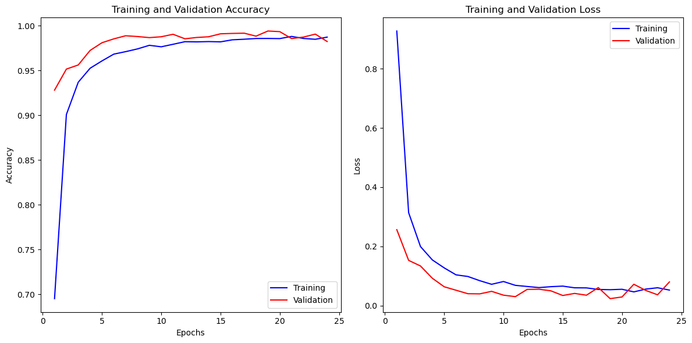
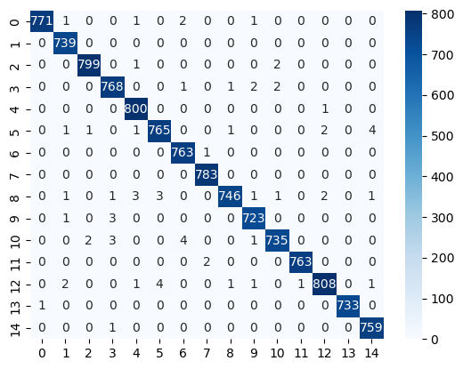

# Pr2-FSI
Second practice for Fundamentals of Intelligent Systems.

Authored by Juan Carlos Domínguez Dopazo and Asmae Ez Zaim Driouch, from group 43.

University of Las Palmas de Gran Canaria

## Goals

Throughout the process, we delve into the essential fundamentals of neural networks, addressing key aspects such as layers, neurons, and activation functions. The central objective is to develop an efficient model capable of recognizing and classifying images with high precision.

## Development

The original dataset used in the practice is called the "Vegetable Image Dataset," and it is a public and free use dataset from Kaggle. You can find it [here](https://www.kaggle.com/datasets/misrakahmed/vegetable-image-dataset).

During the development of the neural network, we explore various versions by adjusting parameters of the training model. We commence with 3 convolutional layers and a dense layer (output layer), achieving an efficiency factor of 0.9578 by modifying dropout and batch size parameters. 

Subsequently, upon adding an additional dense layer, a significant improvement in efficiency is observed. Finally, by introducing one more convolutional layer and fine-tuning dropout and batch size, we attain an efficiency exceeding 99%.

It is noteworthy to highlight the use of data augmentation, a technique that generated variations of the images during training. While the results are based on training with augmented data, we aimed to simulate a real training experience using a considerably augmented dataset.

Regarding the training process, we set 25 epochs due to the substantial size of the dataset. Utilizing hardware with an RTX 3060 GPU, we achieved acceptable training times. In some instances, we observed early stopping or a practically constant efficiency value towards the end of epochs, indicating the model's convergence. This approach allowed us to effectively balance the model's quality with computational efficiency.

| Version | Conv. Layers | Dropout | Maxpooling | Dense layers | Efficiency |
| --- | ------------ | ------- | ---------- | ------------ | ---------- |
| 1   | 8, 8, 8            | 0.05, 0.05, 0.10    | (2,2), (2,2), (2,2)     | 15          | 0.8843     |
| 2   | 16, 16, 16          | 0.05, 0.05, 0.10    | (2,2), (2,2), (2,2)      | 15           | 0.9413     |
| 3   | 32, 64, 64           | 0.25, 0.25, 0.10    | (2,2), (2,2), (2,2)     |  15           | 0.9578     |
| 4   | 32, 64, 128           | 0.25, 0.25, 0.50    | (2,2), (2,2), (2,2)      | 128, 15          | 0.9837     |
| 5   | 32, 64, 128          | 0.25, 0.25, 0.50    | (2,2), (2,2), (2,2)      | 128, 15          | 0.9859     |
| 6   | 32, 64, 128, 256           | 0.25, 0.25, 0.50    | (2,2), (2,2), (2,2), (2,2)      | 128, 15    | 0.9894     |
| 7   | 32, 64, 256, 256          | 0.25, 0.25, 0.50   | (2,2), (2,2), (2,2), (2,2)     | 128, 15     | 0.9916     |
| 8   | 64, 64, 128, 128           | 0.25, 0.25, 0.50   | (2,2), (2,2), (2,2), (2,2)     | 256, 15          | 0.9941     |

## Conclusions
The final version of the model delivers a level of efficiency that we find satisfactory. When examining the graphical representations of performance metrics, we observe a curve that reflects the model's performance. 

The graphs generated during the training and validation of the model provide a detailed view of its behavior across epochs. In this context, the consistency in efficiency as we progress through the training process is a key indicator of the model's ability to generalize and maintain optimal performance even on previously unseen data.

Finally, tests are conducted, and their accuracy is verified:

If needed to train the neural network with the identical dataset used in the table with its corresponding data augmentation, it is available [here](https://alumnosulpgc-my.sharepoint.com/:u:/g/personal/juan_dominguez113_alu_ulpgc_es/EXnoJ80Be-9CoQKoFEwPYBwBV3GM1fqbAJAzmI2F25f6VA?e=DESfXl).
